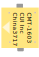
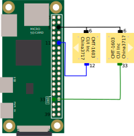
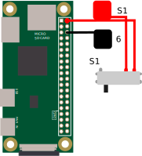

# TinyPi Guide
Here is a guide for those who are lost, I hope it will helps you fellow stranger...

Useful Links
* http://pinout.xyz
* tinypi hackaday page
* tiny pi schematic for eagle
* tiny pi guide
* tiny pi instructions video
* tiny pi instructions video 2

[PHOTO MOD CASE]

# Troubleshooting
... So you messed up soldering the PCB to the Raspberry Pi Zero.    
If your connections doesn't work reliably, you will need to solder
cables between each components and the Raspberry Pi.

I used a Raspberry pi where I have previously solder the usb solder pad and I think this is the reason I messed up.

[PHOTO ERROR]

But first, Here is some observations, I made that could be useful to check your tinyPi.

## Screen

* Screen doesn't light up : GND/3.3V not connected
* Screen works when moved only : PCB not soldered correctly to the Pi.
* Screen has artifact/ is glitchy : IO pins are not correctly connected (Probably PCB problems)
* Screen stay White : Only GND/3.3V connected.
* Screen turn white when moved : PCB not soldered correctly to the Pi

## Speaker
      
You won't be able to properly test speakers without games, you can however test with a terminal.
```
speaker-test -Dhw:0,0 -c2 -twav
```

* Speaker doesn't do any sound : PWM not connected
* Speaker emit a kinda loud static sound : GND not connected
* Speaker intermitly doesn't work : PCB not soldered correctly to the Pi

## Buttons
You won't be able to properly test buttons without games.
### NAV 

* LEFT/RIGHT : change menu 
* UP/DOWN : change games
* PRESS --> ENTER : Start button (check with nes games it should start the game)

### BUTTONS
          
* BTZ --> CTRL: OK in retropie 
* BTX --> ALT: Cancel in retropie

### SWITCH
   
* PRESS : Select (check with mario should change to 2 players)   
Note that the current retropie build for tinyPi also fast-forward game when you press
select as "SPACE" 
* LEFT -->  x : (check with a snes/genesis game ?)
* RIGHT --> z :  (check with a snes/genesis game ?)

# Soldering guide
So now, you know you have seriously messed up something, if you damaged a components
some of them are pretty cheap and easy to find.    
But if this is "just" a issue with the pcb/raspberry pi connection.    
Here is how to solder cables.    

I recommended using really small cable (awg 30 wrapping cable)     
You will probably need to **file/cut** the case for the cables.    
**Obviously use cables only as a last resort**   
**This guide wasn't extensively check, so if there is incorrect information please
tell me***

Here is for eachs pins the corresponding **physical pins** on the Raspberry Pi    
I also used my system, which I find useful to tell someone else where to solder
http://pinout.xyz

**This can also be useful if you want to check your connections with a multimeter.**

## U$1 - Screen

01. 3.3V@1 -- 01
02. 3.3V@1 -- 01
03. N$3    -- 19
04. N$6    -- 18
05. N$7    -- 24
06. N$2    -- 23
07. GND@8  -- 06
08. NOT CONNECTED
09. N$1 -- 22
10. GND@8 -- 06
11. N$14 -- RESISTOR
12. GND@2 -- 25
13. NOT CONNECTED

## R1 - Resistor (10 ohm)
01. (RIGHT) 3V3@2 -- 17 
02. (LEFT) N$14 -- Screen 11

## SG1/SG2 Speakers

### SG1 (LEFT)

01. (TOP) GND@8 -- 06
02. (BOT) NS$13 -- 12


### SG2 (RIGHT)
01. (TOP) GND@8 -- 06
02. (BOT) NS$15 -- 33


## BTN - BTX/BTZ/NAV/U$2

### BTX - Button X

01. (TOP LEFT) NS$12 -- 13 
02. (BOTTOM-RIGHT) GND@1 -- 9 


### BTZ - Button Z

01. (TOP LEFT) NS$11 -- 15
02. (BOTTOM-RIGHT) GND@1 -- 9


### NAV - Joystick

#### TOP
01. (TOP) N$9 -- 29 
02. N$4 - 37 
03. N$8 - 31 

#### BOT
01. (TOP) N$5 - 35
02. GND@3 - 39
03. N$10 - 27

### U$2 - UPPER SWITCH

01. (TOP RIGHT) GND@8 - 06
02. (BOTTOM LEFT) N$16 - 08 
03. (BOTTOM MIDDLE) N$17 - 10
04. (BOTTOM RIGHT) N$18 - 16

### Power Slide (S1/BAT)


#### Power Slide

01. (TOP MIDDLE) -- N$21/N$20 -- BAT +
02. (TOP RIGHT) --  5V0@2 -- 1

### BAT Pads
01. (BAT+) -- N$21/N$20 -- S1 TOP MIDDLE
02. (BAT-) -- GND@8 -- 06 
